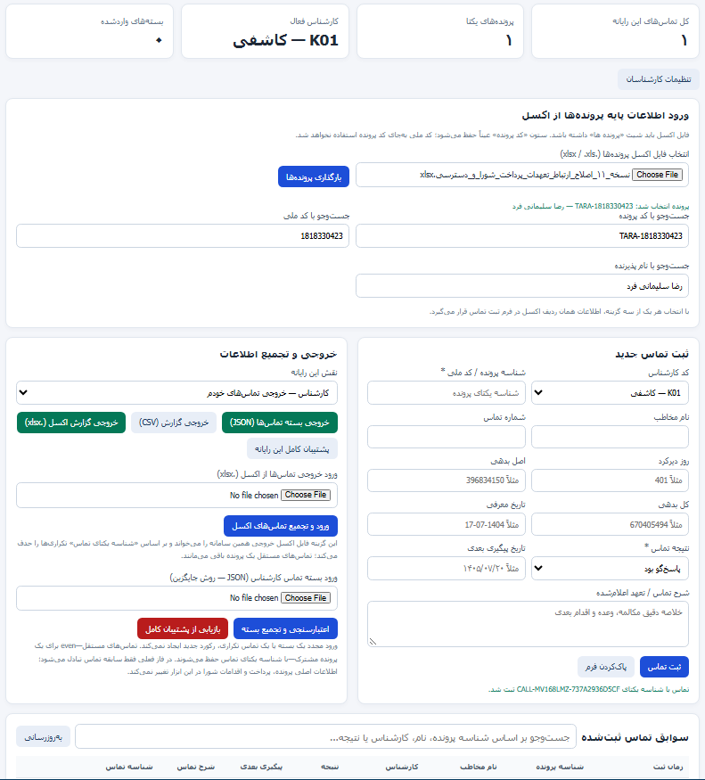

# CRM 2671

  

**سامانه مدیریت و پیگیری پرونده‌ها و تماس‌ها**

سامانه‌ای تحت وب برای مدیریت اطلاعات پرونده‌ها، جست‌وجو، ثبت تماس‌ها، پیگیری کارشناسان و ورود و خروج اطلاعات اکسل.
# CRM 2671

**سامانه مدیریت و پیگیری تماس‌ها و پرونده‌ها**

CRM 2671 یک سامانه تحت وب برای مدیریت اطلاعات پرونده‌ها، پیگیری تماس‌ها و ثبت نتایج ارتباط با افراد است. این سامانه با هدف دسترسی سریع به اطلاعات، کاهش خطاهای ثبت اطلاعات و منظم‌سازی فرایند پیگیری طراحی شده است.

## امکانات

* **ورود اطلاعات از Excel:** بارگذاری اطلاعات پرونده‌ها از فایل اکسل.
* **جست‌وجوی پرونده:** جست‌وجو بر اساس کد پرونده، کد ملی یا نام و نام خانوادگی.
* **مشاهده اطلاعات پرونده:** نمایش اطلاعات ثبت‌شده از جمله شماره تماس، روزهای دیرکرد، اصل بدهی، کل بدهی، تاریخ معرفی و کارشناس.
* **ثبت تماس‌ها:** ثبت سوابق تماس و نتایج پیگیری.
* **مدیریت کارشناسان:** مشاهده و ویرایش اطلاعات کارشناسان از بخش تنظیمات.
* **خروجی Excel:** دریافت اطلاعات ثبت‌شده برای بررسی و گزارش‌گیری.
* **رابط کاربری تحت وب:** اجرا از طریق مرورگر.

## فناوری و نحوه اجرا

این نسخه به‌صورت یک برنامه تحت وب ارائه می‌شود و امکان انتشار آن از طریق GitHub Pages وجود دارد.

پس از انتشار، سامانه از طریق نشانی اینترنتی مخزن در دسترس خواهد بود.

## نکات مهم امنیتی

* اطلاعات واقعی، کدهای ملی، شماره تماس‌ها و اطلاعات مالی افراد را در مخزن عمومی قرار ندهید.
* در نسخه‌ای که از ذخیره‌سازی محلی مرورگر استفاده می‌کند، اطلاعات لزوماً بین دستگاه‌ها و کاربران مختلف مشترک نیست.
* GitHub Pages به‌تنهایی احراز هویت اختصاصی، پایگاه داده مرکزی یا مدیریت دسترسی کاربران را فراهم نمی‌کند.
* برای استفاده سازمانی و چندکاربره، باید زیرساخت امن سمت سرور و پایگاه داده در نظر گرفته شود.

## انتشار

برای انتشار از طریق GitHub Pages:

1. فایل اصلی برنامه را با نام `index.html` در ریشه مخزن قرار دهید.
2. وارد بخش **Settings → Pages** شوید.
3. گزینه **Deploy from a branch** را انتخاب کنید.
4. شاخه `main` و پوشه `/(root)` را انتخاب و ذخیره کنید.

---

**نام سامانه:** CRM 2671
**نسخه:** مطابق فایل منتشرشده در مخزن
**وضعیت:** توسعه و نگهداری مستمر
